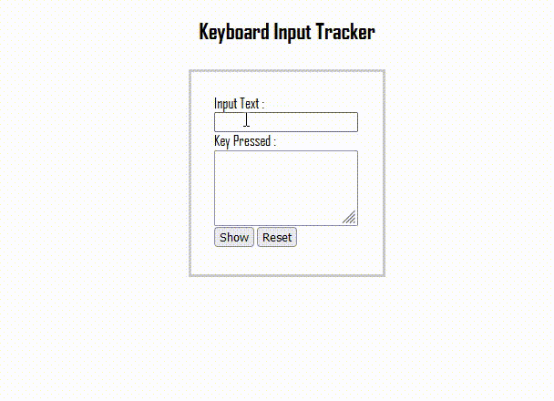

# JavaScript
## Recent JavaScript Mini_project 
---
### 1. __Keyboard Input Tracker__
 In this project, I developed a "keyboard input tracker". It captures and displays the keys pressed in an input field. When I click the "__Show__" button, a __popup__ appears with the recorded keys. Additionally, I can reset the input field and recorded keys by clicking the "__Reset__" button. It's a user-friendly feature that allows manage keyboard input easily   
     

Show Preview
 

  
    

  <h4>
    <a href="https://github.com/dizas9/Full_Stack_webDev/tree/main/JavaScripts/practice/JS-Event_keydown" style="display: inline-block;">Show Code</a>
  </h4>

## Note's on Javascript
1. [JavaScript Object](https://github.com/dizas9/Full_Stack_webDev/blob/main/JavaScripts/Js_object.md)

